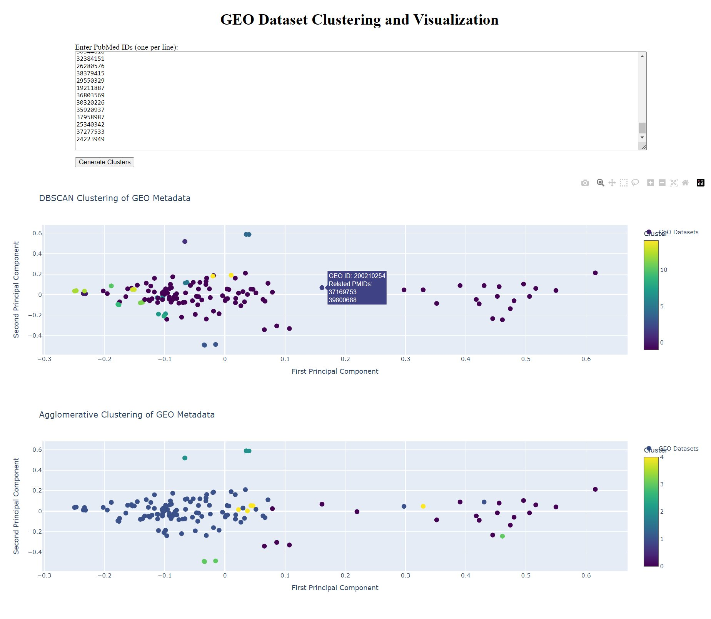

# GEO Dataset Clustering and Visualization

A web service that performs clustering analysis on Gene Expression Omnibus (GEO) datasets based on their metadata similarity. This tool helps researchers visualize and analyze relationships between GEO datasets associated with specific PubMed IDs.

## Features

- Interactive web interface for inputting PubMed IDs
- Automatic retrieval of associated GEO datasets using NCBI E-utilities
- Metadata extraction and analysis from GEO datasets
- Two clustering approaches:
  - DBSCAN clustering for density-based grouping
  - Agglomerative clustering for hierarchical grouping
- Interactive visualizations using PCA dimensionality reduction
- Hover information showing GEO IDs and related PMIDs

## Example media

<p align="center">

</p>

## Prerequisites

- Python 3.x
- Required Python packages:
  - dash
  - requests
  - scikit-learn
  - numpy
  - plotly

## Installation

1. Clone the repository:

```bash
git clone https://github.com/yourusername/jetbrains-pubtrends.git
cd jetbrains-pubtrends
```

2. Install the required packages:

```bash
pip install -r requirements.txt
```

## Usage

1. Start the web service:

```bash
python app.py
```

2. Open your web browser and navigate to `http://localhost:8050`

3. Enter one or more PubMed IDs in the text area (one ID per line)
   (may not work for a small number of IDs, because of the requirements of clustering algorithms)

4. Click "Generate Clusters" to analyze the datasets

5. View the interactive visualizations showing:
   - DBSCAN clustering results
   - Agglomerative clustering results

## Technical Details

The service follows this workflow:

1. Accepts PMIDs from the web form
2. Fetches associated GEO datasets using NCBI E-utilities in bulk
3. Retrieves metadata for each GEO dataset
4. Converts metadata to TF-IDF vectors
5. Performs DBSCAN and Agglomerative clustering
6. Creates interactive visualizations with PCA dimensionality reduction

## Notes

- Inputs with a large number of PMIDs might take a while to process
- The service uses NCBI E-utilities for data retrieval
- Only PMIDs present in the input form are considered in the analysis
- Both clustering methods (DBSCAN and Agglomerative) are used to provide different perspectives on the data relationships
- The visualizations are interactive and allow hovering over points to see detailed information
